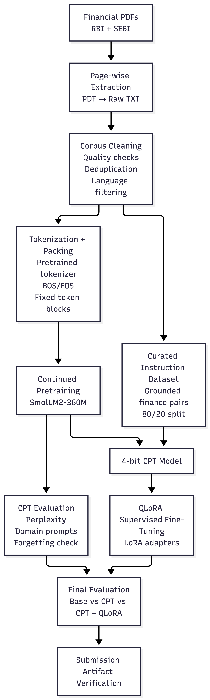

# Assignment 1A: Continued Pretraining and QLoRA

### Domain: **Indian Financial Markets and Digital Payments**

This repository contains the implementation for Assignment 1A covering:

- PDF text extraction and corpus cleaning
- Tokenization and packed dataset creation
- Continued Pretraining (CPT)
- Domain evaluation and perplexity comparison
- Instruction dataset generation
- QLoRA supervised fine-tuning
- Base vs CPT vs CPT+QLoRA evaluation

### Pipeline Architecture

The assignment follows a two-stage model adaptation pipeline.

- **Continued Pretraining (CPT)** adapts the pretrained language model to the terminology, structure, and statistical patterns of the finance-domain corpus.
- **QLoRA** performs parameter-efficient supervised fine-tuning using curated finance instruction-response pairs.
- The final evaluation compares the **Base**, **CPT**, and **CPT + QLoRA** model stages to examine the effect of each adaptation step.

At a high level, the pipeline is:

**Financial PDFs → Extraction → Cleaning → Tokenization & Packing → CPT → CPT Evaluation → QLoRA → Final Evaluation → Artifact Verification**

The instruction dataset used for QLoRA is derived separately from the cleaned finance corpus so that CPT and supervised instruction tuning remain distinct stages of the assignment.

### Corpus

The current source corpus contains **10 publicly available financial-domain documents** from RBI and SEBI.

The corpus covers topics including:

- Equity derivatives and individual trader behaviour
- Securities buy-back regulation
- Infrastructure Investment Trusts
- Municipal debt securities
- Investor protection
- Digital payments
- UPI
- Payment-system benchmarking and development

Source PDFs are stored under:

`data/corpus/v1/Finance/`

The notebook discovers and processes the available PDF files using relative paths rather than relying on a hardcoded document count.

### Executing the IPYNB Notebook

Open `Assignment-1a.ipynb` and execute the notebook cells in order.

The notebook is designed so that the main processing stages execute sequentially:

1. PDF ingestion and page-wise text extraction
2. Corpus quality assessment and cleaning
3. Tokenization using the pretrained model tokenizer
4. Fixed-length packed dataset creation
5. Base-model inspection and baseline generation
6. Continued Pretraining (CPT)
7. CPT evaluation using held-out perplexity and prompt-based checks
8. Instruction dataset preparation and train/evaluation split
9. QLoRA supervised fine-tuning
10. Base vs CPT vs CPT+QLoRA evaluation
11. Submission artifact verification

Required Python packages are checked by the notebook and missing dependencies are installed when required.

For Kubeflow execution, the notebook should be run from persistent storage using relative paths and a CUDA-enabled Python environment.

### Generated Outputs

During execution, the notebook creates the required output directories and artifacts, including:

- Raw and cleaned corpus text
- Tokenized and packed CPT dataset
- CPT model checkpoint
- CPT training-loss plots and statistics
- Base and CPT held-out perplexity results
- General-domain catastrophic-forgetting evaluation
- Instruction dataset JSONL file
- Instruction training and evaluation splits
- QLoRA adapter
- QLoRA training and validation metrics
- Base / CPT / QLoRA prompt evaluations

A final verification stage checks that the required assignment artifacts are present and that dataset counts are internally consistent.

### Model Adaptation Summary

The assignment separates domain adaptation from instruction tuning:

- **Base Model:** provides the original pretrained language-model baseline.
- **CPT Model:** continues causal language modelling on the cleaned finance-domain corpus to improve domain predictive fit.
- **CPT + QLoRA Model:** applies supervised instruction tuning to the CPT model using a small curated finance instruction dataset.

This separation allows the effects of domain-language adaptation and instruction-response adaptation to be evaluated independently.

## Notes

The original PDFs under `data/corpus/v1/` are treated as the source corpus and should not be modified during preprocessing.

Cleaning is applied only to derived text files. The pipeline removes or flags low-value extraction artifacts such as:

- table-of-contents material
- repeated headers and footers
- page-number noise
- acknowledgements
- strongly table-dominated extraction

Substantive regulatory content, schedules, annexures, findings, definitions, and explanatory sections are retained where they contain useful domain information.

The notebook uses relative paths and dynamically derives corpus and dataset counts where practical so that the workflow remains reproducible when executed in the target Kubeflow environment.